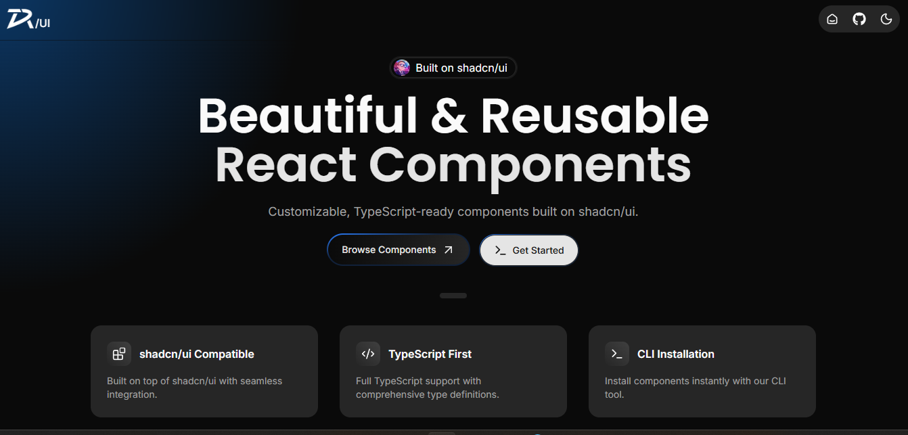

# Devvarena UI



Beautiful and reusable React components built on top of [shadcn/ui](https://ui.shadcn.com). TypeScript-ready, customizable, and easy to integrate.

## Features

- ✨ **Built on shadcn/ui** - Leverages Radix UI primitives and Tailwind CSS
- 🚀 **CLI Installation** - Install components via CLI (supports npm, yarn, pnpm, bun)
- 📘 **TypeScript Support** - Full type safety with comprehensive interfaces
- 🎨 **Customizable** - Easily customize colors, styles, and behaviors
- 📦 **Component Categories** - Buttons, Cards, Menus, Alerts, and more

## Installation

### Prerequisites

```bash
# Requires shadcn/ui setup in your project
npx shadcn@latest init
```

### Install Components

```bash
# Using npm
npx devvarena-ui@latest add [component-name]

# Using yarn
yarn dlx devvarena-ui@latest add [component-name]

# Using pnpm
pnpm dlx devvarena-ui@latest add [component-name]

# Using bun
bunx devvarena-ui@latest add [component-name]
```

## Quick Start

Visit our [documentation](https://devvarena-ui.vercel.app/docs) to browse components and see live examples.

## Development

```bash
# Install dependencies
bun install

# Run development server
bun dev

# Build for production
bun build

# Run linting
bun lint
```

## Tech Stack

- **Framework:** Next.js 15
- **Language:** TypeScript
- **Styling:** Tailwind CSS 4
- **UI Library:** Radix UI
- **Animation:** Framer Motion
- **Icons:** Lucide React, React Icons

## Project Structure

```
src/
├── devvarena-ui/        # Component library
│   ├── button/          # Button components
│   ├── card/            # Card components
│   ├── menu/            # Menu components
│   └── alert/           # Alert components
├── app/                 # Next.js app directory
├── components/          # Internal components
└── lib/                 # Utilities
```

## License

MIT License - feel free to use in your projects!

## Links

- [Documentation](https://devvarena-ui.vercel.app/docs)
- [Installation Guide](https://devvarena-ui.vercel.app/docs/installation)

---

Built with ❤️ using shadcn/ui
